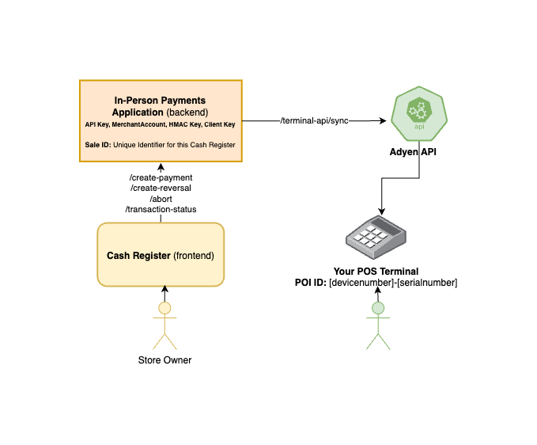

# Adyen [In-person Payment Demo](https://docs.adyen.com/point-of-sale/) Integration Demo

## Run demo in one-click
[](https://gitpod.io/#https://github.com/adyen-examples/adyen-dotnet-online-payments/tree/main/in-person-payments-example)

[First time with Gitpod?](https://github.com/adyen-examples/.github/blob/main/pages/gitpod-get-started.md)

## Description
This demo shows developers how to use the Adyen [Cloud Terminal API](https://docs.adyen.com/point-of-sale/design-your-integration/choose-your-architecture/cloud/) `/terminal-api/sync` to make requests to your connected terminal.

The following implementations are included:
- [Payment requests](https://docs.adyen.com/point-of-sale/basic-tapi-integration/make-a-payment/)
- [Referenced refund requests](https://docs.adyen.com/point-of-sale/basic-tapi-integration/refund-payment/referenced/)
- [Cancel/abort requests](https://docs.adyen.com/point-of-sale/basic-tapi-integration/cancel-a-transaction/)
- [Transaction status requests](https://docs.adyen.com/point-of-sale/basic-tapi-integration/verify-transaction-status/)

There are typically two ways to integrate in-person payments: local or cloud communications.
To find out which solution (or hybrid) suits your needs, visit the following [documentation page](https://docs.adyen.com/point-of-sale/design-your-integration/choose-your-architecture/#choosing-between-cloud-and-local).


This demo leverages Adyen's API Library for .NET ([GitHub](https://github.com/Adyen/adyen-dotnet-api-library) | [Docs](https://docs.adyen.com/development-resources/libraries?tab=c__5#csharp)).
You can find the [Terminal API documentation](https://docs.adyen.com/point-of-sale/design-your-integration/terminal-api/terminal-api-reference/) here.


## Requirements
- A [terminal device](https://docs.adyen.com/point-of-sale/user-manuals/) and a [test card](https://docs.adyen.com/point-of-sale/testing-pos-payments/) from Adyen
- An Adyen account, learn how an Adyen account is structured in [our documentation](https://docs.adyen.com/point-of-sale/design-your-integration/determine-account-structure/)
- .NET Core SDK 6.0+


## 1. Installation
```
git clone https://github.com/adyen-examples/adyen-dotnet-online-payments.git
```


## 2. Set the environment variables
* [Adyen API Key](https://docs.adyen.com/user-management/how-to-get-the-api-key)
* [Adyen HMAC Key](https://docs.adyen.com/development-resources/webhooks/verify-hmac-signatures)
* `ADYEN_POS_POI_ID`: the unique ID of your payment terminal for the NEXO Sale to POI protocol.
   - **Format:** `[device model]-[serial number]` **Example:** `V400m-123456789`

On Linux/Mac/Windows export/set the environment variables.
```shell
export ADYEN_API_KEY=yourAdyenApiKey
export ADYEN_HMAC_KEY=yourHmacKey
export ADYEN_POS_POI_ID=v400m-123456789
```

Alternatively, it's possible to define the variables in the `appsettings.Development.json`.
```json
{
  "ADYEN_API_KEY": "yourAdyenApiKey",
  "ADYEN_HMAC_KEY": "yourHmacKey",
  "ADYEN_POS_POI_ID": "v400m-123456789"
}
```

## 3. Run the application

```shell
dotnet run --project in-person-payments-example 
```


## Usage
1. Select the cloud terminal api integration.
2. Select a table.
3. Select pay to perform a payment.
4. Complete the instructions on your terminal.
5. Select reversal to refund the payment.
6. If webhooks are set up, listen for the notifications to update the payment status (reversals/refunds take a while to receive).


# Webhooks

Webhooks deliver asynchronous notifications about the payment status and other events that are important to receive and process.
You can find more information about webhooks in [this blog post](https://www.adyen.com/knowledge-hub/consuming-webhooks).

### Webhook setup

In the Customer Area under the `Developers → Webhooks` section, [create](https://docs.adyen.com/development-resources/webhooks/#set-up-webhooks-in-your-customer-area) a new `Standard webhook`.

A good practice is to set up basic authentication, copy the generated HMAC Key and set it as an environment variable. The application will use this to verify the [HMAC signatures](https://docs.adyen.com/development-resources/webhooks/verify-hmac-signatures/).

Make sure the webhook is **enabled**, so it can receive notifications.

### Expose an endpoint

This demo provides a simple webhook implementation exposed at `/api/webhooks/notifications` that shows you how to receive, validate and consume the webhook payload.

### Test your webhook

The following webhooks `events` should be enabled:
* **AUTHORISATION**
* **CANCEL_OR_REFUND**
* **REFUND_FAILED**
* **REFUNDED_REVERSED**

To make sure that the Adyen platform can reach your application, we have written a [Webhooks Testing Guide](https://github.com/adyen-examples/.github/blob/main/pages/webhooks-testing.md)
that explores several options on how you can easily achieve this (e.g. running on localhost or cloud).

## Flowchart



