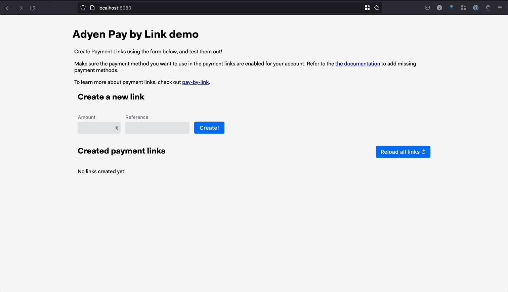

# Adyen [Pay By Link](https://docs.adyen.com/unified-commerce/pay-by-link) Integration Demo

This repository includes an example of Pay By Link with Adyen.
Within this demo app, you can create links by specifying the amount. The shopper can then choose to accept the links and complete the payment.




This demo leverages Adyen's API Library for .NET ([GitHub](https://github.com/Adyen/adyen-dotnet-api-library) | [Docs](https://docs.adyen.com/development-resources/libraries?tab=c__5#csharp)).

> **Note:** We've included a [blog post](https://www.adyen.com/blog/pay-by-link-for-developers) that explains Pay By Link in detail.

## Run integration on [Gitpod](https://gitpod.io/)
1. Open your [Adyen Test Account](https://ca-test.adyen.com/ca/ca/overview/default.shtml) and create a set of [API keys](https://docs.adyen.com/user-management/how-to-get-the-api-key).
    - [`ADYEN_API_KEY`](https://docs.adyen.com/user-management/how-to-get-the-api-key)
    - [`ADYEN_MERCHANT_ACCOUNT`](https://docs.adyen.com/account/account-structure)


2. Go to [Gitpod Environmental Variables](https://gitpod.io/variables) and set the following variables: [`ADYEN_API_KEY`](https://docs.adyen.com/user-management/how-to-get-the-api-key) and [`ADYEN_MERCHANT_ACCOUNT`](https://docs.adyen.com/account/account-structure) with a scope of `*/*`.

3. This demo provides a simple webhook integration at `/api/webhooks/notifications`. For it to work, you need to provide a way for Adyen's servers to reach your running application and add a standard webhook in the Customer Area.
To expose this endpoint locally, we have highlighted two options in step 4 or 5. Choose one or consider alternative tunneling software.

4. To receive notifications asynchronously, add a webhook:
    - In the Customer Area go to `Developers` → `Webhooks` and add a new `Standard notification webhook`
    - Define username and password (Basic Authentication) to [protect your endpoint](https://docs.adyen.com/development-resources/webhooks/best-practices#security) - Basic authentication only guarantees that the notification was sent by Adyen, not that it wasn't modified during transmission
    - Generate the [HMAC Key](https://docs.adyen.com/development-resources/webhooks/verify-hmac-signatures) and set the `ADYEN_HMAC_KEY` in your [Gitpod Environment Variables](https://gitpod.io/variables) -  This key is used to [verify](https://docs.adyen.com/development-resources/webhooks/best-practices#security) whether the HMAC signature that is included in the notification, was sent by Adyen and not modified during transmission
    - For the URL, enter `https://gitpod.io` for now - We will need to update this webhook URL in step 7
    - Make sure the webhook is **Enabled** to send notifications

5. In the Customer Area, go to `Developers` → `Additional Settings` → Under `Acquirer` enable `Payment Account Reference` to receive the Payment Account Reference.


6. Click the button below to launch the application in Gitpod.

[](https://gitpod.io/#https://github.com/adyen-examples/adyen-dotnet-online-payments/tree/main/paybylink-example)


7. Update your webhook in the Customer Area with the public url that is generated by Gitpod
    - In the Customer Area, go to `Developers` → `Webhooks` → Select your `Webhook` that is created in step 4 → `Server Configuration`
    - Update the URL of your application/endpoint (e.g. `https://8080-myorg-myrepo-y8ad7pso0w5.ws-eu75.gitpod.io/api/webhooks/notifications/`)
    - Hit `Apply` → `Save changes` and Gitpod should be able to receive notifications

> **Note** When exiting Gitpod a new URL is generated, make sure to **update the Webhook URL** in the Customer Area as described in the final step. 
> You can find more information about webhooks in [this detailed blog post](https://www.adyen.com/blog/Integrating-webhooks-notifications-with-Adyen-Checkout).


## Run integration on localhost using a proxy
You will need .NET Core SDK 6.x. to run this application locally.

1. Clone this repository

```
git clone https://github.com/adyen-examples/adyen-dotnet-online-payments.git
```


2. Open your [Adyen Test Account](https://ca-test.adyen.com/ca/ca/overview/default.shtml) and create a set of [API keys](https://docs.adyen.com/user-management/how-to-get-the-api-key). 
    - [`ADYEN_API_KEY`](https://docs.adyen.com/user-management/how-to-get-the-api-key)
    - [`ADYEN_MERCHANT_ACCOUNT`](https://docs.adyen.com/account/account-structure)
    


3. This demo provides a simple webhook integration at `/api/webhooks/notifications`. For it to work, you need to provide a way for Adyen's servers to reach your running application and add a standard webhook in the Customer Area.
To expose this endpoint locally, we have highlighted two options in step 4 or 5. Choose one or consider alternative tunneling software.


4. Expose your localhost with Visual Studio using dev tunnels.
    - Add `https://*.devtunnels.ms` to your allowed origins
    - Login to Visual Studio
    - Under `Options` → `Environment` → `Preview Features` → Check `Enable dev tunnels for Web Application`
    - Select `adyen_dotnet_paybylink_example_port_tunneling` as your launch settings profile

If you use Visual Studio 17.4 or higher, the webhook URL will be the generated URL (i.e. `https://xd1r2txt-5001.euw.devtunnels.ms`).


5. Expose your localhost with tunneling software (i.e. ngrok).
    - Add `https://*.ngrok.io` to your allowed origins

If you use a tunneling service like ngrok, the webhook URL will be the generated URL (i.e. `https://c991-80-113-16-28.ngrok.io/api/webhooks/notifications/`).

```bash
  $ ngrok http 8080
  
  Session Status                online                                                                                           
  Account                       ############                                                                      
  Version                       #########                                                                                          
  Region                        United States (us)                                                                                 
  Forwarding                    http://c991-80-113-16-28.ngrok.io -> http://localhost:8080                                       
  Forwarding                    https://c991-80-113-16-28.ngrok.io -> http://localhost:8080           
```


6. To receive notifications asynchronously, add a webhook:
    - In the Customer Area go to `Developers` → `Webhooks` and add a new `Standard notification webhook`
    - Define username and password (Basic Authentication) to [protect your endpoint](https://docs.adyen.com/development-resources/webhooks/best-practices#security) - Basic authentication only guarantees that the notification was sent by Adyen, not that it wasn't modified during transmission
    - Generate the [HMAC Key](https://docs.adyen.com/development-resources/webhooks/verify-hmac-signatures) - This key is used to [verify](https://docs.adyen.com/development-resources/webhooks/best-practices#security) whether the HMAC signature that is included in the notification, was sent by Adyen and not modified during transmission
    - See script below that allows you to easily set your environmental variables
    - For the URL, enter `https://ngrok.io` for now - We will need to update this webhook URL in step 10
    - Make sure the webhook is **Enabled** to send notifications


7. Set the following environment variables in your terminal environment: `ADYEN_API_KEY`, `ADYEN_MERCHANT_ACCOUNT` and `ADYEN_HMAC_KEY`. Note that some IDEs will have to be restarted for environmental variables to be injected properly.

```shell
export ADYEN_API_KEY=yourAdyenApiKey
export ADYEN_MERCHANT_ACCOUNT=yourAdyenMerchantAccount
export ADYEN_HMAC_KEY=yourAdyenHmacKey
```

On Windows CMD you can use this command instead.

```shell
set ADYEN_API_KEY=yourAdyenApiKey
set ADYEN_MERCHANT_ACCOUNT=yourAdyenMerchantAccount
set ADYEN_HMAC_KEY=yourAdyenHmacKey
```


8. In the Customer Area, go to `Developers` → `Additional Settings` → Under `Acquirer` enable `Payment Account Reference` to receive the Payment Account Reference.


9. Start the application and visit localhost.


```shell
dotnet run --project paybylink-example 
```

10. Update your webhook in your Customer Area with the public url that is generated.
  - In the Customer Area go to `Developers` → `Webhooks` → Select your `Webhook` that is created in step 6 → `Server Configuration`
  - Update the URL of your application/endpoint (e.g. `https://c991-80-113-16-28.ngrok.io/api/webhooks/notifications/` or `https://xd1r2txt-5001.euw.devtunnels.ms`)
  - Hit `Apply` → `Save changes` and Gitpod should be able to receive notifications

> **Note** When exiting ngrok or Visual Studio a new URL is generated, make sure to **update the Webhook URL** in the Customer Area as described in the final step. 
> You can find more information about webhooks in [this detailed blog post](https://www.adyen.com/blog/Integrating-webhooks-notifications-with-Adyen-Checkout).


## Usage

1. Visit the main page and create a link.

2. Use the link to finalize the payment.

3. Visit the Customer Area → `Pay By-Link`. 
