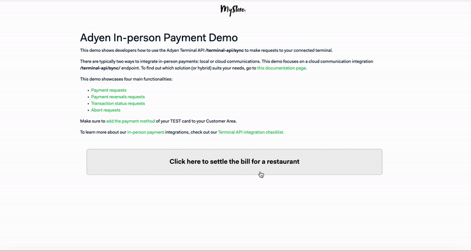
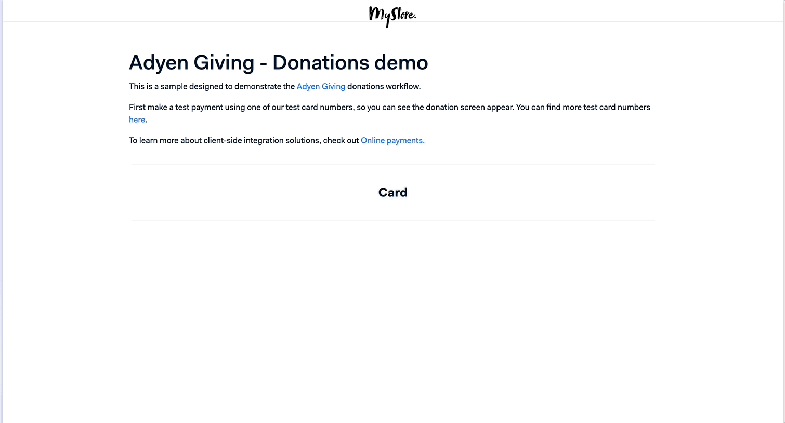
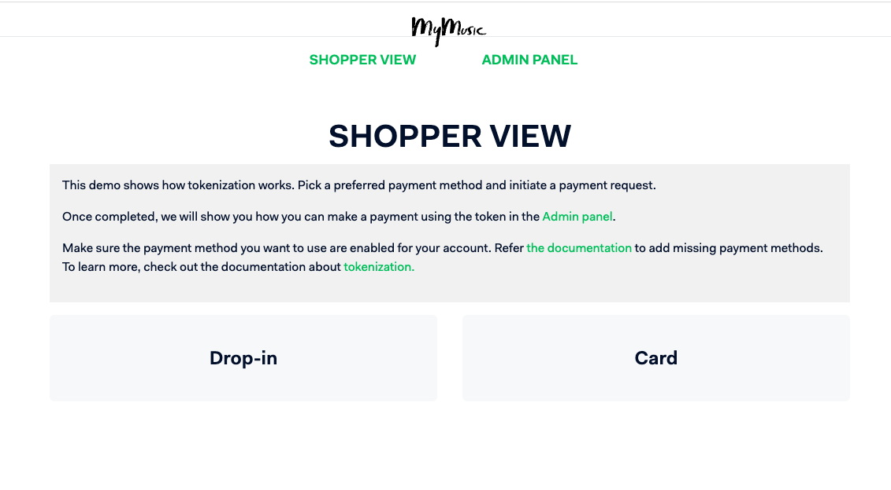

# Adyen Online Payment Integration Demos
[](https://github.com/adyen-examples/adyen-dotnet-online-payments/actions/workflows/build.yml)
[](https://github.com/adyen-examples/adyen-dotnet-online-payments/actions/workflows/e2e.yml) 

This repository includes a collection of PCI-compliant UI integrations that show how to integrate with Adyen using different payment methods. 
The demos below leverages Adyen's API Library for .NET ([GitHub](https://github.com/Adyen/adyen-dotnet-api-library) | [Documentation](https://docs.adyen.com/development-resources/libraries#csharp)). 


## Run with GitHub Codespaces

This repository is configured to work with [GitHub Codespaces](https://github.com/features/codespaces). Each example can be opened in its own Codespace with all dependencies pre-installed.

For detailed setup instructions, see the [GitHub Codespaces Instructions](https://github.com/adyen-examples/.github/blob/main/pages/codespaces-instructions.md).

### Prerequisites

Before running any example, you'll need to set up the following environment variables in your Codespace:

- `ADYEN_API_KEY` - [Your Adyen API key](https://docs.adyen.com/user-management/how-to-get-the-api-key)
- `ADYEN_CLIENT_KEY` - [Your Adyen client key ](https://docs.adyen.com/user-management/client-side-authentication) 
- `ADYEN_MERCHANT_ACCOUNT` - [Your Adyen merchant account](https://docs.adyen.com/account/account-structure)
- `ADYEN_HMAC_KEY` - [Your Adyen HMAC key for webhook validation](https://docs.adyen.com/development-resources/webhooks/verify-hmac-signatures) (optional)

### Setting Environment Variables

1. Go to [Codespaces settings](https://github.com/settings/codespaces)
2. Under Secrets, Click on "New secret"
4. Add the required environment variables and repo access
5. Restart your Codespace

Alternatively, you can set them in the terminal after starting Codespaces:
```bash
export ADYEN_API_KEY="your_adyen_api_key"
export ADYEN_CLIENT_KEY="your_adyen_client_key"
export ADYEN_MERCHANT_ACCOUNT="your_adyen_merchant_account"
```

### Running an Example

1. Click on any "Open in GitHub Codespaces" button below
2. Select an example to run
3. Wait for the Codespace to initialize
4. Navigate to desired project and run `dotnet run ` to start the application
5. Open the forwarded port in your browser

[](https://github.com/codespaces/new/adyen-examples/adyen-dotnet-online-payments?ref=main&devcontainer_path=.devcontainer%2Fdevcontainer.json)


| Demos | Description | Details |
| --: | :-- | :-- |
| [`Checkout Example`](checkout-example) | E-commerce checkout flow with different payment methods. | [See below](#checkout-example) | 
| [`Checkout Advanced Example`](checkout-example-advanced) | E-commerce checkout flow with different payment methods, using the 3 steps flow. | [See below](#checkout-advanced-example) |
| [`Authorisation Adjustment Example`](authorisation-adjustment-example) | Pre-authorise a payment, adjust the authorised amount, capture or reverse the payment. | [See below](#authorisation-adjustment-example) | 
| [`In-person Payments Example`](in-person-payments-example) | In-person payments using a POS terminal and the terminal-api/sync endpoint to create payment requests. | [See below](#in-person-payments-example) |
| [`In-person Payments Loyalty Example`](in-person-payments-loyalty-example) | In-person payments using a POS terminal and the terminal-api/sync endpoint to create card acquisition requests. | [See below](#in-person-payments-loyalty-example) |
| [`Gift Card Example`](giftcard-example) | Gift Cards checkout flow using partial orders. | [See below](#gift-card-example) | 
| [`Giving Example`](giving-example) | Donation flow using Adyen Giving. | [See below](#giving-example) | 
| [`Pay by Link Example`](paybylink-example) | Pay by Link flow. | [See below](#pay-by-link-example) | 
| [`Subscription Example`](subscription-example) | Subscription flow using Adyen tokenization. | [See below](#subscription-example) | 


## [Checkout Example](checkout-example)

The [`checkout example`](checkout-example) repository includes examples of PCI-compliant UI integrations for online payments with Adyen.
Within this demo app, you'll find a simplified version of an e-commerce website, complete with commented code to highlight key features and concepts of Adyen's API.
Check out the underlying code to see how you can integrate Adyen to give your shoppers the option to pay with their preferred payment methods, all in a seamless checkout experience.


## [Checkout Advanced Example](checkout-example-advanced)

The [advanced checkout example](checkout-example-advanced) performs the same functionality as the [checkout example](checkout-example) but using the 3 stages of the Checkout API (Initiate, Submit, and Details) instead of the single `/sessions` endpoint.
See the [advanced integration flow](https://docs.adyen.com/online-payments/web-drop-in/additional-use-cases?tab=sessions_flow_advanced_flow_1) for more information.


## [Authorisation Adjustment Example](authorisation-adjustment-example)

The [`authorisation adjustment example`](authorisation-adjustment-example) repository includes adjust authorisation example for the following three use cases after a pre-authorised payment: incremental, decremental adjustments. Within this demo app, you'll find a simplified version of a hotel booking, where the shopper perform a booking and administrators can **[1] adjust** (increase/decrease) the payment amount, **[2] extend** the authorisation expiry date, **[3] capture** the final amount and/or **[4] reverse** (cancel or refund) an authorised payment


## [In-person Payments Example](in-person-payments-example)

The [in-person payments example](in-person-payments-example) features an in-person payment [cloud terminal API](https://docs.adyen.com/point-of-sale/design-your-integration/choose-your-architecture/cloud/) integration. Within this demo app, you can make in-person payments using a terminal, initiate reversals (refunds) and check transaction statuses.



## [In-person Payments Loyalty Example](in-person-payments-loyalty-example)


The [in-person payments loyalty example](in-person-payments-loyalty-example) features an in-person payment [cloud terminal API](https://docs.adyen.com/point-of-sale/design-your-integration/choose-your-architecture/cloud/) integration. Within this demo app, you can make in-person payments using a terminal, create card acquisition requests, collect card details and apply discounts.


## [Gift Card Example](giftcard-example)

The [`gift card example`](giftcard-example) repository includes a gift card flow during checkout. Within this demo app, you'll find a simplified version of an e-commerce website. The shopper can choose to use gift cards to complete their purchase or use their preferred payment method to pay the remaining amount.


## [Giving Example](giving-example)

The [giving example](giving-example) repository includes a sample designed to demonstrate the Adyen Giving donations flow.
After making a test payment using one of our test card numbers, the donation screen will appear.



## [Pay by Link Example](paybylink-example)

The [`pay by link example`](paybylink-example) repository includes a Pay by Link flow. Within this demo app, you can create links by specifying the amount. The shopper can choose to accept the links and complete the payment.


## [Subscription Example](subscription-example)

The [`subscription example`](subscription-example) repository includes a tokenization example for subscriptions. Within this demo app, you'll find a simplified version of a website that offers a music subscription service.
The shopper can purchase a subscription and administrators can manage the saved (tokenized) payment methods on a separate admin panel.
The panel allows admins to make payments on behalf of the shopper using this token.




## Contributing

We commit all our new features directly into our GitHub repository. Feel free to request or suggest new features or code changes yourself as well!

Find out more in our [contributing](https://github.com/adyen-examples/.github/blob/main/CONTRIBUTING.md) guidelines.


## License

MIT license. For more information, see the **LICENSE** file.